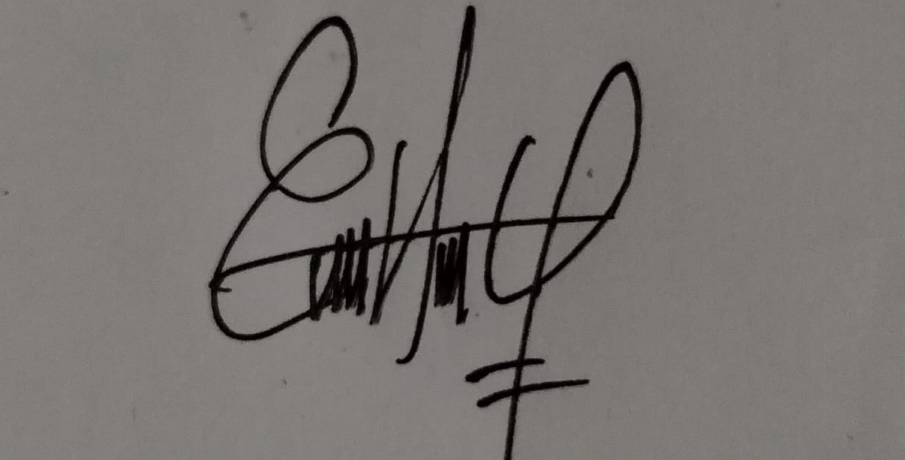

# Acta de Entendimeinto

**proyecto:** Burbuja Pets . Gestor de PQRS
**Curso:** Algoritmia y programació 
**Profesor:** Victor Hugo Mercado Ramos

## Acuerdo del acta 

| Datos de la reunión | Detalles |
|:--- | :--- |
|**Fecha** | 19/sept/2026 |
|**Medio** | Google Meet |
|**Redactor** | Yoela Arrieta |

---

## 1. Integrantes Presentes 

| Nombre completo | Correo institucional | 
| :---: | :--- | 
| Erika Hernandez Galvan | `erika.hernandezg@ude.edu.co` |
| Yanidi Yoela Arrieta Requeme | `yoela.arrieta@udea.edu.co`|
| Darci Vanessa Londoño Ortiz | `dvanessa.londono@udea.edu.co`|
| Lorena Isabel Orrego Sierra | `lorena.orrego@udea.edu.co`|

---

## 2. Objetivo comunes del grupo

1. Desarrollar un programa de consola en python con un menú amigable para registar, validar y gestionar los PQRS de Burbujas Pets.
2.  Entregar un repositorio de GitHub ordenado y documentos con Markdown.
3. Construir un tablero de control en Power BI con las estadísticas especificadas en la rubrica.  
4. Cumplir con el 100% de los entregables en las fechas establecidas.
5. Comprender los codigos completos antes de la sustentación 

---

## 3. Expectativa de cada integrante

| Integrantes | Lo que espera aportar | meta personal |
| :--- | :--- | :--- | 
|**Erika Hernandez**| Asumir el liderato del repositorio y mantener una comunicación asertiva para delegar responsabilidades, pensamiento lógico | Aprender muy bien el manejo de GitHub |
|**Yoela Arrieta** | validación y estructuración de datos, analisis y diseño del sistema, pensamiento lógico | entender muy bien como funcionan los codigos |
|**Darci Londoño** | Manejo de datos y archivos, pensamiento lógico,limpieza de codigos | entender muy bien sobre la gestion de los entornos locales de los programas a utilizar |
|**Lorena Orrego** | Persistencia y control de archivos, pruebas y depuración, pensamiento lógico | manejar el dominio de la sintaxis e identificaion de fallas en variables, ciclos y demás |

---

## 4. Bases de acuerdo 

- **Respeto:** se escuchan todas las ideas con igual importancia y se toman deciones teniendo en cuenta la prioridad y exigencia de la tarea.
- **Aprendizaje:** Los deberes asignados a cada integrante debe ser claro y comprensible para las demas integrantes.
- **Honestidad:** El uso de IA es valido pero cada integrante debe poder conocer y explicar el codigo que entrega.
- **Compromiso:** Nos hacemos responsable de los que nos comprometemos s hacer y avisar con anticipacion si algo sale mal o no es comprensible.

---

## 5. Firma de validacion de acuerdo 

| Integrantes | Nombre Completo | Firma | 
| :--- | :--- | :--- |
| Integrante 1 | Erika Hernandez Galvan |  |
| Integrante 2 | Yanidi Yoela Arrieta Requeme |   |
| Integrante 3 | Darci Vanessa Londoño Ortiz |   |
| Integrante 4 | Lorena Isabel Orrego Sierra |   |

